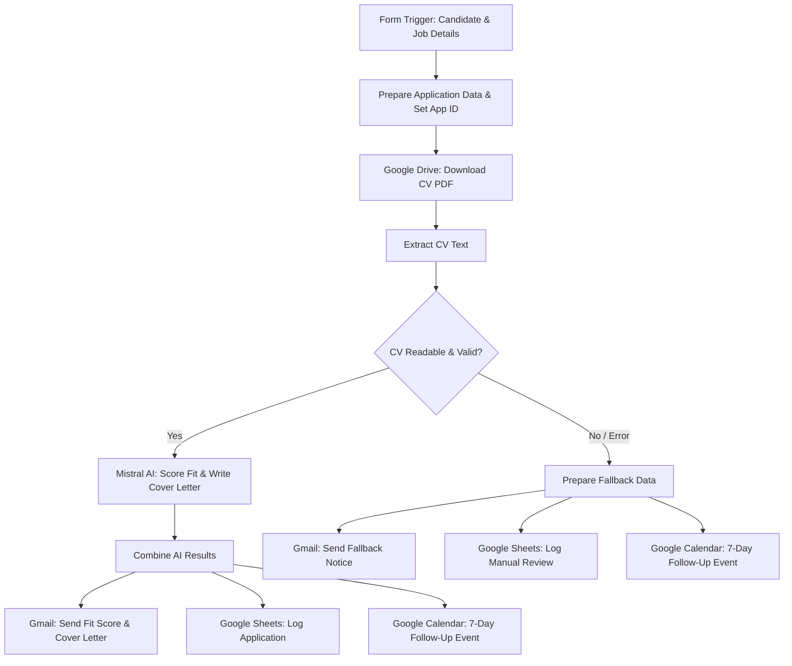

# Job Application Autopilot 🤖💼

An automated, AI-powered job application processing workflow built on **n8n**.

**Job Application Autopilot** automates the end-to-end workflow when applying for jobs or evaluating job applications. It collects application details and CVs via a form, extracts text from Google Drive PDFs, evaluates candidate fit using an evidence-based 100-point AI scoring rubric (powered by **Mistral AI**), generates a tailored cover letter, sends an email summary to the candidate, logs everything in **Google Sheets**, and creates a **7-day follow-up event in Google Calendar**.

---

## 🌟 Key Features

- 📋 **Form Trigger Submission**: User-friendly submission form collecting applicant details, target position, company, job description, portfolio link, and Google Drive CV link.
- 📥 **Google Drive & PDF Parsing**: Automatically downloads the candidate CV from Google Drive and extracts readable text.
- 🧠 **AI Fit Scoring Engine (Mistral AI)**: Evaluates the candidate strictly against the job description using a 100-point evidence-based rubric (no AI hallucinations allowed).
- ✍️ **Automated Cover Letter Generation**: Generates a professional 250–350 word cover letter connecting CV achievements directly to the job requirements.
- 📧 **Gmail Integration**: Sends an instant email notification containing the fit score, evidence breakdown, matching/missing skills, and custom cover letter (with built-in fallback error handling if PDF extraction fails).
- 📊 **Google Sheets Application Tracker**: Logs every application ID, fit score, confidence score, matching skills, missing skills, and detailed reasoning into a Google Sheet.
- 📅 **Automated 7-Day Follow-Up (Google Calendar)**: Automatically schedules a calendar entry 7 days post-submission to remind you to follow up with the hiring team.

---

## 🏗️ Workflow Architecture



---

## 📊 100-Point Evidence-Based Scoring Rubric

The AI model evaluates the CV against the Job Description strictly using explicit evidence present in the CV:

| Category | Max Score | Description |
| :--- | :---: | :--- |
| **Core / Required Skills** | 30 | Direct evidence matching core job requirements |
| **Relevant Experience** | 20 | Explicit employment, internships, or professional roles |
| **Projects / Practical Work** | 15 | Technical complexity and relevance of listed projects |
| **Education / Degree** | 10 | Degree level and relevant academic background |
| **Job Responsibilities Match**| 10 | Direct proof of performing target responsibilities |
| **Certifications** | 5 | Verifiable certifications explicitly listed in CV |
| **Tools & Technologies** | 5 | Match against required tech stack and tools |
| **ATS & JD Terminology** | 5 | Alignment with key industry terminology |
| **Total Score** | **100** | Sum of all criteria |

---

## 📁 Repository Structure

```
.
├── workflow.json    # Complete exported n8n workflow JSON definition
└── README.md        # Project documentation & setup guide
```

---

## 🚀 Setup & Setup Instructions

### 1. Prerequisites
- An active **n8n** instance (n8n Cloud or Self-Hosted)
- A **Mistral AI API Key** (configured for `magistral-small-latest` or equivalent)
- A **Google Cloud / Workspace** account with access to:
  - Google Drive OAuth2
  - Google Sheets OAuth2
  - Google Calendar OAuth2
  - Gmail OAuth2

### 2. Importing into n8n
1. Open your n8n dashboard.
2. Click **Workflows** -> **Import from File**.
3. Select `workflow.json` from this repository.

### 3. Credential Setup in n8n
In n8n, re-bind or assign your credentials for:
- **Google Drive OAuth2 API**: Access to download candidate CVs.
- **Mistral Cloud API**: API key for the LLM node.
- **Gmail OAuth2**: Authorized email sender.
- **Google Sheets OAuth2 API**: Selected spreadsheet for tracking applications.
- **Google Calendar OAuth2 API**: Target calendar for 7-day follow-up reminders.

### 4. Configuration Updates
- In **Google Sheets - Log Application**, ensure your spreadsheet ID and sheet tab are linked.
- In **Google Calendar - 7 Day Follow-up**, ensure your calendar ID / target email address is specified.

### 5. Activation
Toggle the workflow switch from `Inactive` to **`Active`**. Submit a test response using the Form Trigger URL to verify execution!

---

## 🛠️ Built With

- [n8n](https://n8n.io/) - Workflow Automation Platform
- [Mistral AI](https://mistral.ai/) - LLM for CV Analysis & Cover Letter Generation
- [Google Workspace APIs](https://workspace.google.com/) - Google Drive, Sheets, Calendar, Gmail
