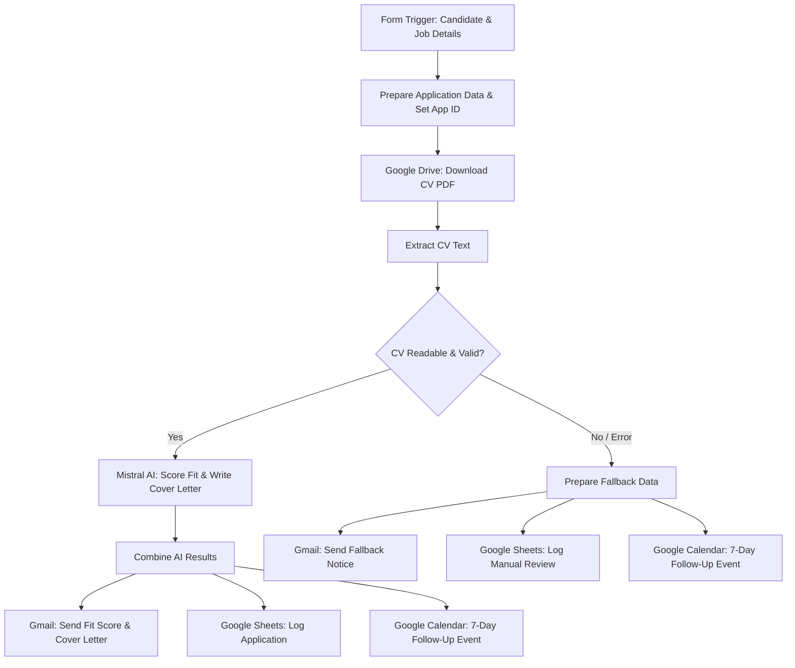

# Job Application Autopilot 🤖💼

An automated, AI-powered job application processing workflow built on **n8n**.

---

# 1. 📖 WHAT IT DOES

**Job Application Autopilot** automates the end-to-end process of submitting, scoring, and tracking job applications using AI and Google Workspace integrations.

## 🌟 Key Capabilities & Workflow Features

- 📋 **Form Submission Processing**: Collects candidate details, job title, company name, job description, portfolio URL, and Google Drive CV link via an interactive n8n form trigger.
- 📥 **Automated CV Retrieval & Text Extraction**: Downloads the candidate's CV from Google Drive and extracts PDF text for analysis.
- 🧠 **AI-Powered CV Fit Scoring (Mistral AI)**: Evaluates the candidate CV against the job description using a strict 100-point evidence-based rubric (zero hallucination policy).
- ✍️ **Tailored Cover Letter Generation**: Generates a custom 250–350 word cover letter connecting explicit CV achievements directly to job requirements.
- 📧 **Automated Email Notifications (Gmail)**: Emails the candidate/applicant a full breakdown of their fit score, matching skills, skill gaps, and generated cover letter (includes fallback error notifications if PDF parsing fails).
- 📊 **Centralized Spreadsheet Tracking (Google Sheets)**: Logs all application records, application IDs (`APP-YYYYMMDD-HHMMSS`), scores, matching/missing skills, and detailed reasoning into Google Sheets.
- 📅 **Automated 7-Day Follow-Up Reminder (Google Calendar)**: Automatically schedules a calendar entry 7 days post-submission to remind you to follow up with the hiring manager.

## 🏗️ Workflow Architecture



## 📊 100-Point Evidence-Based Scoring Rubric

| Category | Max Score | Description |
| :--- | :---: | :--- |
| **Core / Required Skills** | 30 | Direct evidence matching core job requirements |
| **Relevant Experience** | 20 | Explicit employment, internships, or professional roles |
| **Projects / Practical Work** | 15 | Technical complexity and relevance of listed projects |
| **Education / Degree** | 10 | Degree level and relevant academic background |
| **Job Responsibilities Match**| 10 | Direct proof of performing target responsibilities |
| **Certifications** | 5 | Verifiable certifications explicitly listed in CV |
| **Tools & Technologies** | 5 | Match against required tech stack and tools |
| **ATS & JD Terminology** | 5 | Alignment with key industry terminology |
| **Total Score** | **100** | Sum of all criteria |

---

# 2. 🚀 HOW TO USE

Follow these steps to import, configure, and execute the workflow in your n8n environment.

### Step 1: Prerequisites
Before starting, ensure you have:
1. An active **n8n** instance (n8n Cloud or Self-Hosted).
2. A **Mistral AI API Key** (configured for `magistral-small-latest`).
3. Google Workspace credentials connected in n8n for:
   - **Google Drive OAuth2** (to download CVs)
   - **Gmail OAuth2** (to send emails)
   - **Google Sheets OAuth2** (to log application data)
   - **Google Calendar OAuth2** (to create follow-up reminders)

### Step 2: Import `workflow.json` into n8n
1. Download or clone this repository.
2. Log into your **n8n Dashboard**.
3. Go to **Workflows** -> click **Import from File**.
4. Select `workflow.json` from this repository.

### Step 3: Configure Node Credentials
In n8n, edit the imported workflow nodes to assign your credentials:
1. **Google Drive - Download CV**: Select your Google Drive OAuth2 credential.
2. **Mistral Chat Model**: Select your Mistral Cloud API credential.
3. **Gmail - Send Cover Letter / Fallback Message**: Select your Gmail OAuth2 credential.
4. **Google Sheets - Log Application**: Select your Google Sheets OAuth2 credential and select your target tracking spreadsheet.
5. **Google Calendar - 7 Day Follow-up**: Select your Google Calendar OAuth2 credential and set your primary calendar ID.

### Step 4: Activate & Test the Workflow
1. Click the **Active** toggle switch in n8n to enable the workflow.
2. Open the **Job Application Form** trigger node to obtain your form URL.
3. Fill out the form with test candidate data and a Google Drive CV link.
4. Submit the form and verify that:
   - An email is received via Gmail with the fit score and cover letter.
   - A new row is appended to your Google Sheet tracker.
   - A follow-up event is created in Google Calendar 7 days from today.

---

## 📁 Repository Structure

```
.
├── workflow.json    # Complete exported n8n workflow JSON definition
└── README.md        # Project documentation
```

## 🛠️ Built With

- [n8n](https://n8n.io/) - Workflow Automation Platform
- [Mistral AI](https://mistral.ai/) - LLM Engine
- [Google Workspace APIs](https://workspace.google.com/) - Google Drive, Sheets, Calendar, Gmail
